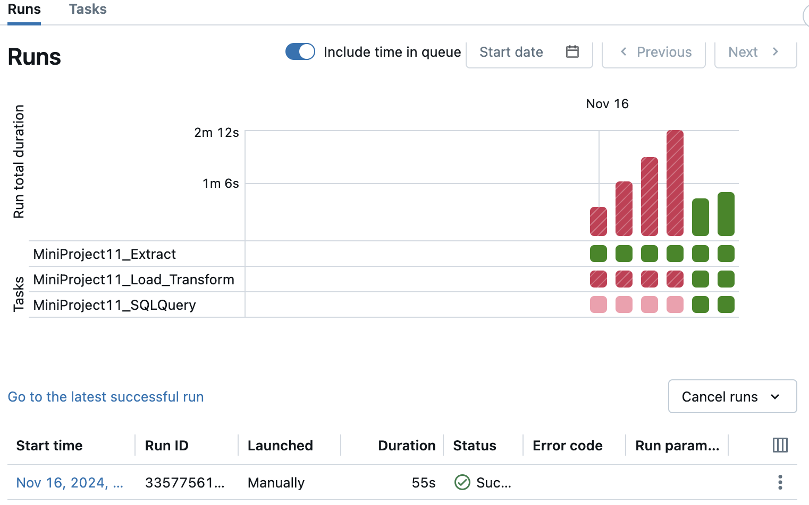

## MiniProject 11: Data Pipeline with Databricks

# Workflow

# Pipeline Summary

## 1. Extract
- **Purpose**: Extract the data from a URL and store it in **Databricks File System (DBFS)**.
- **Steps**:
  1. Fetch the dataset from the provided URL using `pandas`.
  2. Save the dataset locally within the Databricks environment.
  3. Copy the file to a specified DBFS path (`dbfs:/FileStore/mini_project11/`).
  4. Convert the Pandas DataFrame into a Spark DataFrame.
  5. Save the Spark DataFrame into a Delta table (`grade_student_delta`).

---

## 2. Load and Transform
- **Purpose**: 
  - Load the dataset from **DBFS**.
  - Save it as a **Delta table**.
  - Perform **data transformation** (add new columns based on predefined conditions) and update the Delta table.

- **Steps**:
  1. **Load**: Read the CSV file from DBFS into a Spark DataFrame.
  2. Save the DataFrame as a Delta table (`grade_student_delta`) in overwrite mode.
  3. **Transform**:
     - Add a new column `STEM_major` to categorize majors based on predefined STEM categories (`core_STEM`, `other_STEM`, or `Other`).
     - Use schema evolution (`mergeSchema`) to update the existing Delta table with the transformed data.

---

## 3. Query
- **Purpose**: 
  - Execute SQL queries on the Delta table to analyze data.
  - Save SQL queries to a file and execute them dynamically.

- **Steps**:
  1. Execute an SQL query to group data by `Major_category` and calculate summary statistics (e.g., total employment, unemployment, etc.).
  2. Save an SQL query (`SELECT * FROM grade_student_delta`) into a file (`sample_query.sql`).
  3. Read the SQL query from the file and execute it against the Delta table to display results.

---

## Pipeline Workflow:
1. **Extract Phase**: Fetch the raw data, store it in DBFS, and initialize the Delta table.
2. **Load and Transform Phase**: Load the dataset, save it as a Delta table, and enhance it with transformations.
3. **Query Phase**: Analyze the transformed data and dynamically execute SQL queries from files.
